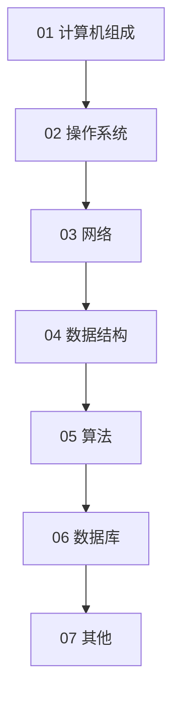

# 计算机基础

面向「理解底层后再学语言」的读者，按自底向上组织。

## 学习路径

建议与 [languages/c/](../languages/c/) 并行学习：数据结构章节与 C 语言数组、指针、链表高度相关。

## 章节目录

| 序号 | 章节 | 状态 | 说明 |
|------|------|------|------|
| 01 | [computer-architecture](01-computer-architecture/) | 计划中 | CPU、内存、缓存 |
| 02 | [operating-systems](02-operating-systems/) | 计划中 | 进程、线程、文件系统 |
| 03 | [networking](03-networking/) | 计划中 | TCP/IP、HTTP、DNS |
| 04 | [data-structures](04-data-structures/) | 已发布 | 数组、链表、栈、队列、树 |
| 05 | [algorithms](05-algorithms/) | 已发布 | 排序、查找、复杂度 |
| 06 | [databases](06-databases/) | 计划中 | SQL、索引、事务 |
| 07 | [computer-science-misc](07-computer-science-misc/) | 计划中 | 编译原理入门、编码 |

## 章节结构

每章包含 `guides/`（教程）、`references/`（速查）、`exercises/`（练习），详见 [docs/style-guide.md](../docs/style-guide.md)。
