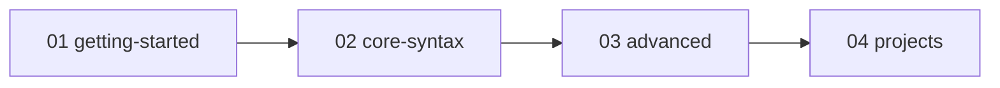

# （语言名称）

> 替换本文件标题与描述。示例：[languages/c/](../c/)

## 学习路径

| 阶段 | 目录 | 说明 |
|------|------|------|
| 入门 | [guides/01-getting-started/](guides/01-getting-started/) | |
| 核心语法 | [guides/02-core-syntax/](guides/02-core-syntax/) | |
| 进阶 | [guides/03-advanced/](guides/03-advanced/) | |
| 实战 | [guides/04-projects/](guides/04-projects/) | |

完整大纲见 [syllabus.md](syllabus.md)。

## 内容索引

| 类型 | 入口 |
|------|------|
| 系统教程 | [guides/](guides/) |
| 语法速查 | [references/](references/) |
| 代码示例 | [examples/](examples/) |
| 练习题 | [exercises/](exercises/) |
| 考试/认证 | [exams/](exams/)（可选） |

## 使用说明

1. 复制 `_template/` 为 `languages/<lang>/`
2. 填写 `syllabus.md` 与本文 README
3. 在 `guides/` 各阶段目录下按 `01-topic-name.md` 命名新增教程
4. 在 [languages/README.md](../README.md) 注册新语言
