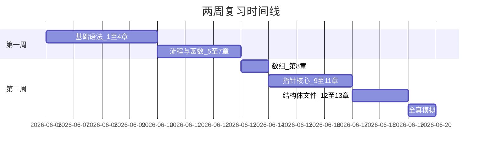

# C 语言期末考试 — 两周复习计划

> 依据 [期末考试大纲.md](./期末考试大纲.md) 制定  
> 考试专题索引：[certifications/university/c-language/](../../../certifications/university/c-language/README.md)  
> 适用教材：苏小红《C语言程序设计（第5版）》第 1～13 章  
> 建议每日学习 **2.5～3 小时**（可拆为上午 1.5h 理论 + 晚上 1.5h 刷题/编程）

---

## 计划总览

| 阶段 | 天数 | 覆盖章节 | 目标 |
|------|------|----------|------|
| **第一周：基础与流程** | 第 1～7 天 | 第 1～7 章 | 夯实语法，掌握分支/循环/函数 |
| **第二周：核心突破** | 第 8～13 天 | 第 8～13 章 | 攻克指针、数组、链表、文件 |
| **冲刺** | 第 14 天 | 全书 | 模拟自测、查漏补缺 |



---

## 每日任务模板

每天按 **「学 → 练 → 写 → 查」** 四步执行：

| 步骤 | 时间 | 内容 |
|------|------|------|
| **学** | 40～60 min | 读教材对应章 + [语法速查](../references/README.md) |
| **练** | 40～60 min | 刷 [本题库](./prompt.md) 对应题型 |
| **写** | 30～45 min | 手写 1～2 道编程题（不看答案） |
| **查** | 10～15 min | 对照答案，记录错题到「错题本」 |

---

## 第一周：基础与流程（第 1～7 天）

> 本周目标：能独立写出含输入输出、分支、循环、函数的完整小程序。

---

### 第 1 天 · 程序入门与数据类型

**对应章节**：第 1 章、第 2 章

| 时段 | 任务 |
|------|------|
| 学 | 第 1 章全文；第 2 章 2.1～2.5；阅读 [01-程序基础](../references/01-程序基础.md)、[02-数据类型与常量](../references/02-数据类型与常量.md) |
| 练 | [选择题](./选择题.md) 第 1～15 题；[填空题](./填空题.md) 第 1～10 题 |
| 写 | 编写 Hello World；声明各类型变量并用 `printf` 输出 `sizeof` 结果 |
| 查 | 核对标识符规则、进制常量、`sizeof` 是否掌握 |

**今日过关标准**

- [ ] 能说出编辑→编译→链接→运行四步
- [ ] 能判断合法/非法标识符
- [ ] 能计算 `"abc"`、`'A'`、`0x1A` 等常量含义

---

### 第 2 天 · 运算符与表达式

**对应章节**：第 3 章

| 时段 | 任务 |
|------|------|
| 学 | 第 3 章全文；重点 `++i`/`i++`、短路求值、类型转换；阅读 [03-运算符](../references/03-运算符.md)、[10-预处理](../references/10-预处理.md) |
| 练 | [选择题](./选择题.md) 第 16～30 题；[纠错题](./纠错题.md) 第 1～5 题 |
| 写 | 手写 3 道表达式求值题（含混合类型、自增自减）并验算 |
| 查 | 背诵 [附录 C 运算符优先级](./期末考试大纲.md#运算符优先级速查附录-c-精简) 前 6 级 |

**今日过关标准**

- [ ] 能正确计算 `5/2`、`5.0/2`、`++i` 与 `i++` 混合表达式
- [ ] 能区分 `#define` 与 `const`
- [ ] 能解释 `&&`、`||` 短路求值

---

### 第 3 天 · 输入与输出

**对应章节**：第 4 章

| 时段 | 任务 |
|------|------|
| 学 | 第 4 章全文；阅读 [11-输入输出](../references/11-输入输出.md) |
| 练 | [选择题](./选择题.md) 第 31～40 题；[纠错题](./纠错题.md) 第 6～12 题（重点 `scanf` 漏 `&`） |
| 写 | 编写程序：输入两个整数，格式化输出和、差、积、商（ `%d` `%f` 格式控制） |
| 查 | 整理 `%d/%f/%lf/%c/%s` 与类型的对应表 |

**今日过关标准**

- [ ] 所有 `scanf` 均正确使用 `&`
- [ ] 能控制 `printf` 宽度与小数位数（如 `%5.2f`）
- [ ] 知道 `%c` 前吸收换行的处理方法

---

### 第 4 天 · 选择控制结构

**对应章节**：第 5 章

| 时段 | 任务 |
|------|------|
| 学 | 第 5 章全文；阅读 [04-流程控制](../references/04-流程控制.md) 中 if/switch 部分 |
| 练 | [选择题](./选择题.md) 第 41～55 题；[问答题](./问答题.md) 第 14～18 题 |
| 写 | 编程：闰年判断；成绩等级（A/B/C/D/F）；`switch` 实现简单菜单 |
| 查 | 总结 `if` 与 `switch` 各自适用场景 |

**今日过关标准**

- [ ] 能画出闰年判断流程图
- [ ] 知道 `case` 后必须是整型常量表达式
- [ ] 能解释 `break` 在 switch 中的作用

---

### 第 5 天 · 循环控制结构

**对应章节**：第 6 章

| 时段 | 任务 |
|------|------|
| 学 | 第 6 章全文；阅读 [04-流程控制](../references/04-流程控制.md) 中循环部分 |
| 练 | [填空题](./填空题.md) 第 11～25 题；[纠错题](./纠错题.md) 第 13～20 题 |
| 写 | 编程：1～100 累加；素数判断；九九乘法表；水仙花数（任选 2 道） |
| 查 | 区分 `break` 与 `continue`；比较 for/while/do-while |

**今日过关标准**

- [ ] 能分析简单嵌套循环的执行次数
- [ ] 能独立写出素数/累加/阶乘程序
- [ ] 知道 do-while 至少执行一次

---

### 第 6 天 · 函数与模块化

**对应章节**：第 7 章

| 时段 | 任务 |
|------|------|
| 学 | 第 7 章全文；阅读 [05-函数](../references/05-函数.md) |
| 练 | [问答题](./问答题.md) 第 19～28 题；[选择题](./选择题.md) 第 56～70 题 |
| 写 | 编程：`swap`（值传递失败版 + 指针版预习）；递归求阶乘、斐波那契 |
| 查 | 整理 `auto/static/extern` 对比表 |

**今日过关标准**

- [ ] 能区分形参与实参、值传递机制
- [ ] 能写出含终止条件的递归函数
- [ ] 能解释 `static` 局部变量为何保留值

---

### 第 7 天 · 第一周复盘

**对应章节**：第 1～7 章综合

| 时段 | 任务 |
|------|------|
| 学 | 重读 [期末考试大纲](./期末考试大纲.md) Part 2 速查表第 1～7 行 |
| 练 | [选择题](./选择题.md) 第 71～100 题中挑 20 题；[填空题](./填空题.md) 第 26～40 题 |
| 写 | 综合编程：输入 n 个数，求最大/最小/平均值（用函数封装） |
| 查 | 回顾本周错题本；补漏薄弱章 |

**本周总验收**

- [ ] 选择题正确率 ≥ 75%（基础部分）
- [ ] 能 30 分钟内写出「输入 + 分支/循环 + 函数」完整程序
- [ ] 附录 C 运算符优先级能默写前 8 级

---

## 第二周：核心突破（第 8～13 天）

> 本周目标：掌握指针与数组（占分 30%+），能写链表和文件操作程序。

---

### 第 8 天 · 数组与算法基础

**对应章节**：第 8 章

| 时段 | 任务 |
|------|------|
| 学 | 第 8 章全文；阅读 [07-数组](../references/07-数组.md) |
| 练 | [选择题](./选择题.md) 中与数组相关的题；[问答题](./问答题.md) 第 33～37 题 |
| 写 | 编程：冒泡排序；二分查找；矩阵转置（任选 2 道，见 [编程题](./编程题.md) 第 21～30 题） |
| 查 | 理解数组名作参数为何退化、为何要传长度 |

**今日过关标准**

- [ ] 能手写冒泡排序核心双重循环
- [ ] 知道二维数组行优先存储
- [ ] 能计算 `int a[10]` 的 `sizeof(a)`

---

### 第 9 天 · 指针（一）

**对应章节**：第 9 章

| 时段 | 任务 |
|------|------|
| 学 | 第 9 章全文；精读 [06-指针](../references/06-指针.md) |
| 练 | [纠错题](./纠错题.md) 第 21～35 题；[问答题](./问答题.md) 第 29～34 题 |
| 写 | 编程：指针版 `swap`；用指针遍历数组求和 |
| 查 | 画图理解 `int a=5; int *p=&a;` 中 p 与 *p 的值 |

**今日过关标准**

- [ ] 能解释 `&`、`*`、NULL 的含义
- [ ] 能追踪 5 行以内指针程序的输出
- [ ] 知道野指针与悬空指针的区别

---

### 第 10 天 · 字符串

**对应章节**：第 10 章

| 时段 | 任务 |
|------|------|
| 学 | 第 10 章全文；阅读 [08-字符串](../references/08-字符串.md)、[14-常用库函数](../references/14-常用库函数.md) |
| 练 | [选择题](./选择题.md) 中字符串相关题；[填空题](./填空题.md) 第 41～55 题 |
| 写 | 编程：不用库函数实现字符串长度；回文判断；小写转大写 |
| 查 | 整理 `strlen/strcpy/strcat/strcmp` 功能与返回值 |

**今日过关标准**

- [ ] 知道 `"abc"` 占 4 字节（含 `'\0'`）
- [ ] 能区分 `char s[]` 与 `char *p`
- [ ] 知道 `gets` 不安全，应使用 `fgets`

---

### 第 11 天 · 指针与数组、动态内存

**对应章节**：第 11 章

| 时段 | 任务 |
|------|------|
| 学 | 第 11 章全文；阅读 [13-动态内存](../references/13-动态内存.md)；复习 [06-指针](../references/06-指针.md) |
| 练 | [纠错题](./纠错题.md) 第 36～55 题（**重点日，至少 15 题**） |
| 写 | 编程：`malloc` 动态分配数组并排序；指针实现字符串反转 |
| 查 | 区分 `int *p[]` 与 `int (*p)[N]`；整理 malloc/calloc/free 用法 |

**今日过关标准**

- [ ] 理解 `a[i]` 等价于 `*(a+i)`
- [ ] 能写出完整的 malloc → 使用 → free 流程
- [ ] 能读懂 10 行以内指针+数组程序输出（**期末最高频**）

---

### 第 12 天 · 结构体与单向链表

**对应章节**：第 12 章

| 时段 | 任务 |
|------|------|
| 学 | 第 12 章全文，**重点 12.8 单向链表**；阅读 [09-结构体与枚举](../references/09-结构体与枚举.md) |
| 练 | [问答题](./问答题.md) 第 71～85 题；[选择题](./选择题.md) 中结构体/枚举题 |
| 写 | 编程：定义 `Student` 结构体，输入 3 人按成绩排序；链表创建+遍历+尾插 |
| 查 | 整理 `.` 与 `->` 使用场景；链表删除结点步骤 |

**今日过关标准**

- [ ] 能定义 struct 并正确访问成员
- [ ] 能说出 union 与 struct 的区别
- [ ] 能独立写出链表结点结构体及插入/遍历代码（**编程必考**）

---

### 第 13 天 · 文件操作

**对应章节**：第 13 章

| 时段 | 任务 |
|------|------|
| 学 | 第 13 章全文；阅读 [12-文件操作](../references/12-文件操作.md) |
| 练 | [填空题](./填空题.md) 第 56～70 题；[问答题](./问答题.md) 中与文件相关题目 |
| 写 | 编程：复制文本文件；统计文件中某字符出现次数 |
| 查 | 整理 `fopen` 模式 `"r"` `"w"` `"a"` `"rb"` 等 |

**今日过关标准**

- [ ] 能写出 fopen → 读写 → fclose 完整模板
- [ ] 知道文本文件与二进制文件的区别
- [ ] 能使用 `fscanf`/`fprintf` 或 `fgetc`/`fputc`

---

### 第 14 天 · 冲刺模拟与查漏补缺

**对应章节**：第 1～13 章综合

| 时段 | 任务 |
|------|------|
| 上午 | 通读 [期末考试大纲 Part 2 速查表](./期末考试大纲.md#part-2-考点速查表) + 运算符优先级 + 易错点清单 |
| 下午 | **模拟自测**（建议 120 分钟，闭卷） |

#### 模拟试卷结构（自测用）

| 题型 | 数量 | 建议用时 | 题库来源 |
|------|------|----------|----------|
| 选择题 | 25 题 | 30 min | [选择题](./选择题.md) 随机抽 |
| 填空题 | 12 空 | 15 min | [填空题](./填空题.md) 随机抽 |
| 纠错题 | 3 题 | 20 min | [纠错题](./纠错题.md) 随机抽 |
| 简答题 | 3 题 | 25 min | [问答题](./问答题.md) 随机抽 |
| 编程题 | 2 题 | 30 min | 1 道数组/循环 + 1 道指针或链表 |

| 晚上 | 对照答案批改；错题回归对应章；重点再看指针题 |

**冲刺日过关标准**

- [ ] 模拟总分 ≥ 72 分（及格线）
- [ ] 编程题至少完成 1 道可编译运行的完整程序
- [ ] 指针相关题正确率 ≥ 60%

---

## 题库刷题进度建议

按两周计划，各题型建议完成量（共 500 题库不必全刷，抓重点即可）：

| 题型 | 建议完成量 | 重点章节题号方向 |
|------|------------|------------------|
| 选择题 | 80～100 题 | 指针、字符串、控制流程 |
| 填空题 | 50～70 题 | 格式符、关键字、函数名 |
| 问答题 | 30～40 题 | 函数、指针、链表、文件 |
| 纠错题 | 40～55 题 | **第 9～11 章相关占一半** |
| 编程题 | 15～20 道 | 见下方「必做编程题清单」 |

---

## 必做编程题清单（15 道）

按优先级排序，考前至少手写完成一遍：

| 优先级 | 题目 | 对应章 | 题库题号参考 |
|--------|------|--------|--------------|
| ★★★ | 闰年 / 成绩等级 | 5 | 编程题 4、5 |
| ★★★ | 素数 / 阶乘 / 水仙花数 | 6 | 编程题 6～8、61 |
| ★★★ | 冒泡排序 / 二分查找 | 8 | 编程题 21、24 |
| ★★★ | 指针 swap / 数组求和 | 9 | 编程题 31、37 |
| ★★★ | 字符串回文 / 反转 | 10 | 编程题 18、39 |
| ★★★ | 动态数组分配与排序 | 11 | 编程题 40 |
| ★★★ | Student 结构体排序 | 12 | 编程题 42、43 |
| ★★★ | 链表创建、遍历、插入 | 12 | 编程题 49、50 |
| ★★ | 递归阶乘 / 斐波那契 | 7 | 编程题 34、35 |
| ★★ | 矩阵转置 / 加法 | 8 | 编程题 28、30 |
| ★★ | 文件复制 / 字符统计 | 13 | 编程题 44、46 |
| ★ | 九九乘法表 / 图案打印 | 6 | 编程题 13、62 |
| ★ | 最大公约数 | 7 | 编程题 32 |
| ★ | 统计字符串中字母数字个数 | 10 | 编程题 15 |
| ★ | 简单计算器 | 综合 | 编程题 56 |

---

## 时间不够时的压缩方案

若每天只能学 **1.5 小时**，按以下优先级取舍：

1. **必保**（第 9～12 章）：指针、字符串、动态内存、链表 — 占 4 天
2. **次保**（第 5～8 章）：分支、循环、函数、数组 — 占 3 天
3. **速览**（第 1～4、13 章）：数据类型、I/O、文件 — 占 2 天
4. **刷题 + 模拟** — 占 2 天
5. 第 14 章（游戏设计）**不纳入复习**

---

## 复习资源索引

| 类型 | 链接 |
|------|------|
| 考试大纲 | [期末考试大纲.md](./期末考试大纲.md) |
| 语法速查 | [references/README.md](../references/README.md) |
| 选择题 | [选择题.md](./选择题.md) · [参考答案](./选择题_参考答案.md) |
| 填空题 | [填空题.md](./填空题.md) · [参考答案](./填空题_参考答案.md) |
| 问答题 | [问答题.md](./问答题.md) · [参考答案](./问答题_参考答案.md) |
| 纠错题 | [纠错题.md](./纠错题.md) · [参考答案](./纠错题_参考答案.md) |
| 编程题 | [编程题.md](./编程题.md) · [参考答案](./编程题_参考答案.md) |
| 示例代码 | [examples/chapter01～13](../examples/) |

---

## 错题本模板

建议用笔记本或电子文档记录，每道错题含四要素：

```
【日期】第 __ 天
【题目来源】选择题 / 纠错题 / 编程题 第 __ 题
【错误原因】概念不清 / 粗心 / 指针追踪失败 / …
【正确思路】（一句话）
【对应章节】第 __ 章 → 回看 references/__-__.md
```

---

*祝复习顺利。计划可根据个人基础微调：基础薄弱者可把第 1 周延长 1～2 天，压缩文件操作练习量；基础较好者可提前进入第 9 章指针。*
